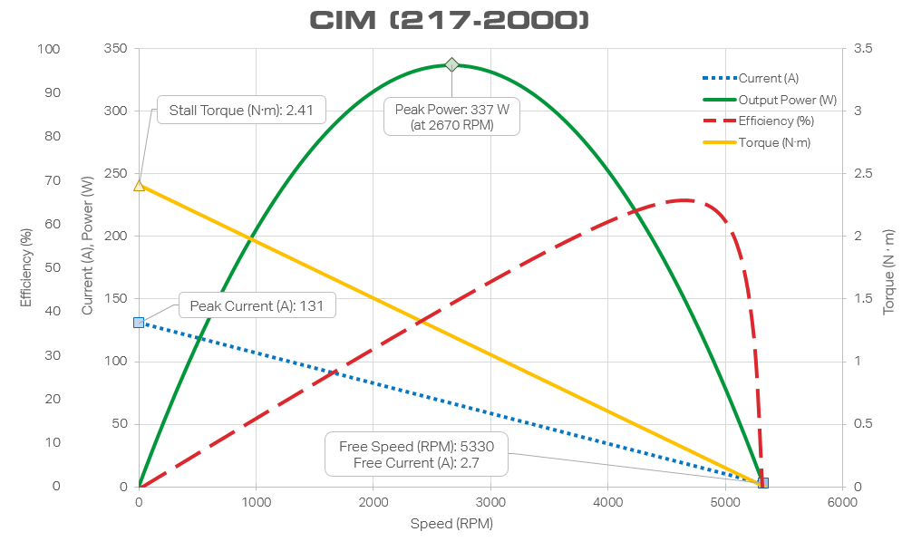
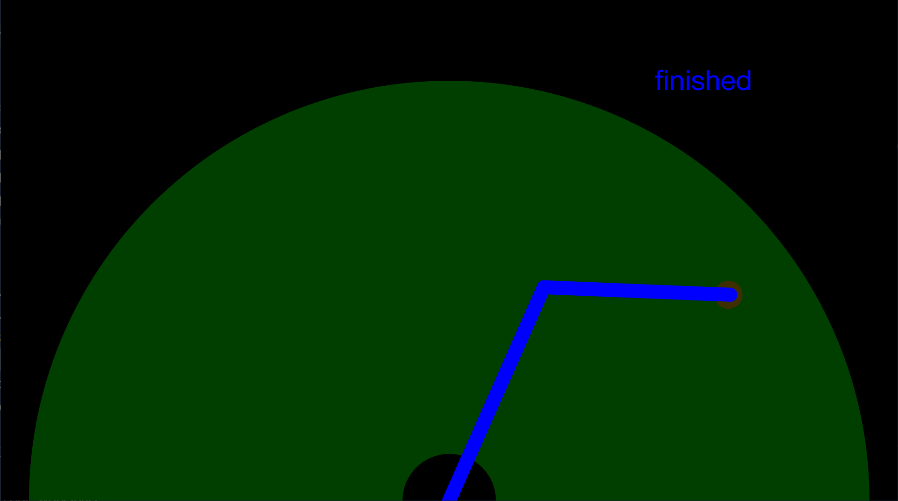
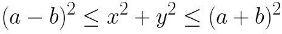
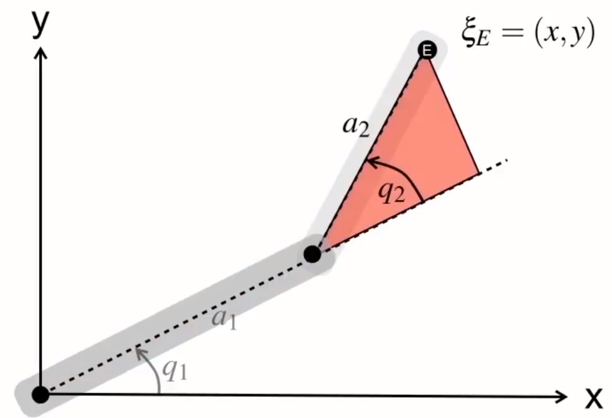
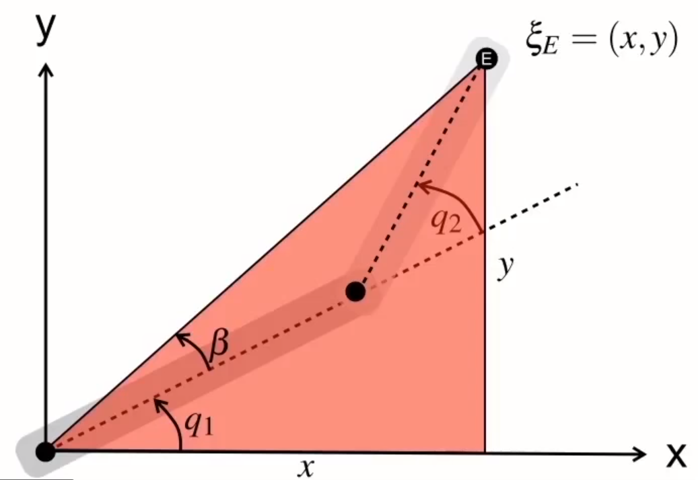
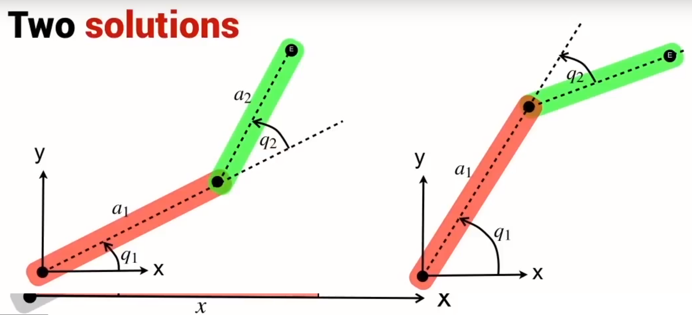

# GoArmSim
GoArmSim is an interactive program that allows the user to give Cartesian coordinate points to a 2-jointed robotic arm and have it move to them using a simple feedback controller and a (somewhat realistic) physics model.

## User Interface
The interface is a minimal GUI using a library designed for created games in Go. It uses a Canvas to draw to and the mouse to select points for the arm to move to. The "ghost" of the user input is the point that would be added to the list if the user clicked their mouse at that time. The user can click and add as many points as they want, and the robot will move through all the points until there are no more points. If given a new point, the arm will switch back into its tracking state and move to the arm.

The sweeping transparent green arc represents the configuration space of the arm (explained further below) in Cartesian space, with the origin at the center of the bottom edge of the window. Mouse coordinates are mapped from their pixel position to their position relative to the origin in meters. The colored text in the top right displays the state the arm is currently in. The arm also changes color corresponding to its state. 

## Motor Model
Motor modelling formulae derived from this book: https://www.chiefdelphi.com/t/paper-practical-guide-to-state-space-control/166417/2

The arm uses CIM motors at each of its joints. A graph of the CIM motor specifications is shown below:

   
 

 
The important constants used/calculated in the motor dynamics model are the stall torque (Newton metres), stall current (amperes), free speed (rotations per minute), and free current (amperes). From there, the resistance within the motor and the velocity constant is calculated. Using these constants, the dynamics of the motor is solved. This model is used to calculate the acceleration of the motor given the voltage being applied and its current rotational velocity. The voltage applied provides torque proportional to itself, whereas the voltage produced by the spinning of the motor is put back into the motor and thus subtracted off. These calculations are further used in the full dynamics model.

## Arm Model
The arm is a two-jointed arm with its second joint able to pass through itself (no collisions between joints). The base joint is powered by two CIM motors as mentioned above with a 159.3:1 gear ratio. The elbow joint is powered by one CIM motor with a 159.3:1 gear ratio. The base joint is 1.0m long with a mass of 30.0kg, while the elbow joint is 0.8m with a mass of 15.0kg.

The configuration space of the arm is defined as the region of space the end-effector (tip of elbow joint) could possibly be in based on the joint angles. The configuration space of this arm is shown below. It is the region of space between two circles above the x-axis. The radius of the inner circle is the length of the base joint minus the length of the elbow joint, and the outer the addition of the two instead.

   
 

To determine whether a goal point is within the configuration space, an inequality representing the configuration space needs to be found. If the length of the base joint is a and the length of the elbow joint b, then the inequality to be solved is (a-b)<=(x^2+y^2)<=(a+b). This calculation is performed in the ClampToCSpace function in **util.go**. If the point given is in the inequality, the point is returned as is. If not, it must be determined whether it is inside the region of space bounded by the a-b radius circle, or outside the a+b radius circle. This is done by comparing the distance from the origin to that point. If that distance is less than a-b, the point returned is on the edge of that circle at the angle the original point was. Similarly, when outside the a+b circle, the point is on the edge of the outside. This prevents the inverse kinematics not being able to determine a solution and crashing the robot. To also prevent crashes, the hypotenuse for the inner and outer edge cases used is *slightly* enlargened/shrunk based on if the point was closer to the smaller circle edge of the bigger one. This is done as it was found during development that rounding errors caused by the trigonometric functions would push the points *just* outside configuration space and crash the code.

   
 

## Inverse Kinematics of the Arm
Inverse Kinematics formulae derived from this video: https://robotacademy.net.au/lesson/inverse-kinematics-for-a-2-joint-robot-arm-using-geometry/

A geometric approach was chosen for solving the inverse kinematics of the arm due to its relative simplicity. Since the arm only has two joints, the algebraic approach involving complex matrix math would be overcomplicated, and a numerical approach where the solution is found using optimization less effective. The calculations involved in the geometric approach boil down to basic trigonometry after a few key triangles are formulated.

 

Because of the symmetry of the cosine function, there are two solutions to the joint angles. These configurations are referred to as "Elbow Up" and "Elbow Down".

   

To decide between the two solutions, the robot operates under the assumption that the end-effector must "face" the goal point. This is done by choosing the set with the negative elbow joint angle (Elbow Down) in quadrant one and positive elbow joint angle (Elbow Up) in quadrant two. This prevents the arm from moving below the y-axis and into the ground when moving between points. 

## Dynamics Model
In conjunction with the motor model, gravity is also modeled into the simulator. Calculations are done discretely, with the time interval being 1/FPS, or in this case 20 milliseconds. Every timestamp, the acceleration the arm experiences from gravity is calculated and subtracted off the acceleration due to the motor. The angular acceleration due to gravity is calculated by dividing the torque from gravity by the arm's moment of inertia. The arm is assumed to be a solid rod rotating about one end. The gravity is modeled to act on the center of gravity of the arm, assumed to be at half the length of the arm (even mass distribution)

## Feedback Controller
Each joint's angle is stored by the arm and used as sensory input for its feedback control. The arm is controlled by two separate PIDF controllers. The P term, kP, provides voltage output to the arm based on the difference in the current angle and the goal angle, acting as a sort of spring pulling the arm towards the goal position. The D term, kD, acts as a dampener to the arm, providing output based on the rate the error is increasing/decreasing, or the velocity of the arm. This term can be thought of as moving through a fluid, where force is proportional to the object's velocity relative to the fluid.

The I term, kI, is the integral term, which provides output based on the sum of errors since starting the motion. An example of the use of the integral is in counteracting gravity pulling the arm down. When gravity is in play, unless kP and kD are tuned *very* well, the arm will stop slightly before getting to setpoint, because the torque provided by the proportional term will match the torque of gravity pulling the arm down. If an integral term is used, as the arm sits just below its goal, the error will accumulate and increase the output until the arm moves to its goal. Having an integral system in a control loop ensures that it will get to its setpoint overcoming resistive forces opposing it, like gravity and friction. A con of this is that it is much more difficult to tune the integral term, because very small changes can cause large output differences during run time, and the arm will overshoot the goal by a large margin if the goal is far away, because the error sum is much larger. 

Because of the knowledge of the arm and its dynamics, the integral term is replaced by the F term in the controller, or feedforward. Using the dynamics model of both the arm and the motor, the controller applies a voltage to the arm that allows it to oppose gravity regardless of where it is in its configuration space. It does this by first calculating the torque acting on the arm by gravity, and then solves for the voltage required to apply the same torque in the opposite direction. The effect of this is the arm "floating" in space, and the rest of the feedback controller will get it to its position. The term as used in this controller isn't a *true* feedforward term because it uses the angle of the arm, but it achieves the same purpose of counteracting known resistive forces in the system. Because this feedforward term is used, the integral term is set to zero, meaning only kP and kD need to be empirically found. Feedforward both performs superior to the integral term and makes tuning the motion of the arm faster.

## State Machine
A state machine is used to control the operations of the arm. Coupled with the updating of the canvas, the state machine updates at 50Hz, performing actions based on the arm's current state. 

Upon window load, the arm starts in the waiting state, where it waits for a goal point. When given a goal point, it switches to the goalTracking state. In the first loop of goal tracking, the arm solves the inverse kinematics required to move it to its goal point and saves the joint angles into memory. During all loops in goalTracking, the arm is commanded to move using the PIDF controller to the goal joint angles with a tolerance of 1 degree and voltage output less than 10% (+ or -). When reaching this tolerance, the state machine switches into its finished state, where it will stay at its current position until another goal point is given. The arm waits a small amount before moving to its next goal point. This process repeats until the window is closed. An advantage of using a state machine is organizing the code and logical execution of the arm's actions into different modes that it switches through either autonomously or from user/programmer input. 

## Potential Improvements
- better decision for pairs (ie. not flipping over at edges of inner c-space)
- coordinating joint movement to avoid ground (running one after another, slowing one down)
- coupled physics model instead of separate arms
- going into ERROR state when given point out of c-space instead of clamping inside

